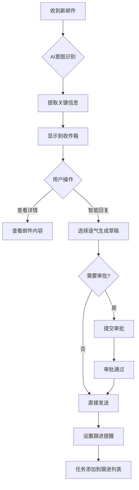
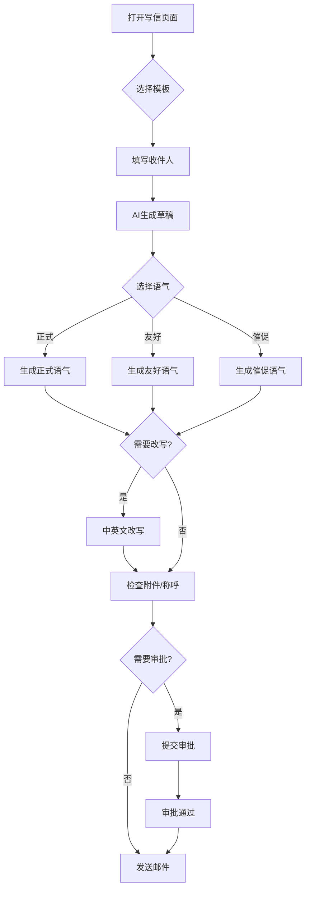

## 1. Product Overview
AI邮件助手是一款面向销售、客服和商务人员的智能邮件处理工具，帮助用户高效处理大量来往邮件，提升工作效率和客户响应质量。
- 核心价值：智能识别邮件意图、自动提取关键信息、生成个性化回复、跟踪邮件处理进度
- 目标用户：销售代表、客服专员、商务经理等需要频繁处理邮件的专业人士

## 2. Core Features

### 2.1 User Roles
| Role | Registration Method | Core Permissions |
|------|---------------------|------------------|
| 普通用户 | 邮箱注册/OAuth | 收发邮件、使用AI功能、查看统计 |
| 管理员 | 后台创建 | 用户管理、系统配置 |

### 2.2 Feature Module
1. **收件箱分析**：邮件列表、意图识别、关键信息提取、快速筛选
2. **联系人详情**：联系人信息、历史邮件记录、互动统计、标签管理
3. **智能写信**：AI生成草稿、语气选择、中英文改写、附件检查、审批流程
4. **跟进任务**：任务列表、提醒设置、状态更新、历史记录
5. **统计概览**：响应时长、成交线索、处理效率、趋势分析

### 2.3 Page Details
| Page Name | Module Name | Feature description |
|-----------|-------------|---------------------|
| 收件箱分析 | 邮件列表 | 展示所有邮件，支持按意图、状态、优先级筛选 |
| 收件箱分析 | 邮件详情 | 邮件内容展示、意图标签、关键信息卡片 |
| 收件箱分析 | 快速操作 | 一键回复、标记状态、设置跟进 |
| 联系人详情 | 联系人信息 | 姓名、公司、职位、联系方式 |
| 联系人详情 | 邮件历史 | 与该联系人的所有邮件往来记录 |
| 联系人详情 | 互动统计 | 邮件数量、响应时间、成交状态 |
| 智能写信 | 邮件编辑器 | 富文本编辑、AI建议、模板选择 |
| 智能写信 | AI助手 | 语气选择、改写润色、附件检查 |
| 智能写信 | 审批流程 | 保存草稿、提交审批、审批后发送 |
| 跟进任务 | 任务列表 | 待跟进、进行中、已完成任务筛选 |
| 跟进任务 | 任务详情 | 任务信息、关联邮件、提醒设置 |
| 统计概览 | 仪表盘 | 响应时长统计、成交转化率、处理效率 |
| 统计概览 | 趋势图表 | 每日/每周数据趋势分析 |

## 3. Core Process

### 3.1 邮件处理流程

### 3.2 智能写信流程

## 4. User Interface Design

### 4.1 Design Style
- **主色调**: 深蓝色 (#1e40af) 搭配浅蓝色点缀 (#3b82f6)
- **辅助色**: 绿色 (#22c55e) 表示成功/已完成，橙色 (#f97316) 表示待跟进，红色 (#ef4444) 表示投诉/紧急
- **按钮样式**: 圆角矩形，hover时有轻微放大效果
- **字体**: Inter（现代简洁风格）
- **布局**: 左侧侧边栏导航 + 右侧内容区域，卡片式设计
- **图标**: Lucide React 图标库，风格简洁统一

### 4.2 Page Design Overview
| Page Name | Module Name | UI Elements |
|-----------|-------------|-------------|
| 收件箱分析 | 邮件列表 | 卡片列表、意图标签、优先级标识、快速操作按钮 |
| 收件箱分析 | 邮件详情 | 邮件标题、发件人信息、正文内容、关键信息提取卡片 |
| 联系人详情 | 联系人卡片 | 头像、姓名、公司、职位、联系方式、标签 |
| 智能写信 | 编辑器 | 收件人输入、主题输入、富文本编辑区、AI建议面板 |
| 智能写信 | AI助手面板 | 语气选择按钮、改写选项、检查提示 |
| 跟进任务 | 任务列表 | 任务卡片、状态标签、截止日期、操作按钮 |
| 统计概览 | 仪表盘 | 数据卡片、图表组件、时间范围选择 |

### 4.3 Responsiveness
- **桌面端**: 完整的侧边栏导航 + 内容区域布局
- **平板端**: 侧边栏可折叠为图标模式
- **移动端**: 底部导航栏，内容区域自适应

### 4.4 Branding
- Logo: AI图标 + 邮件图标组合
- 标语: "智能邮件，高效工作"