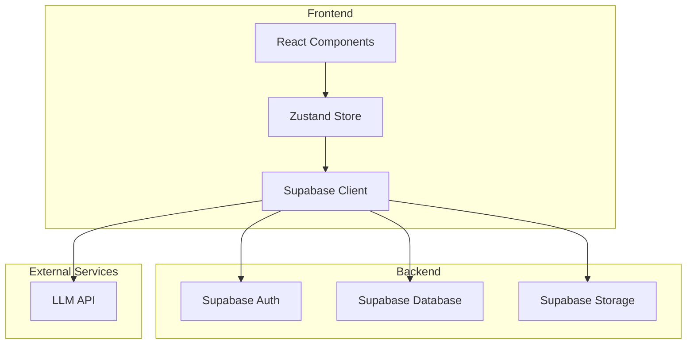
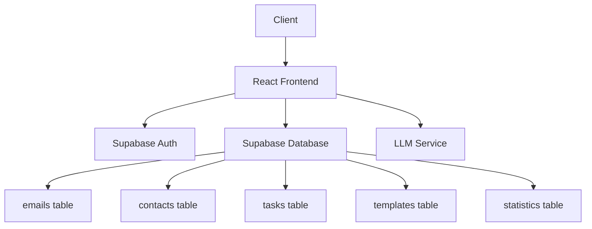
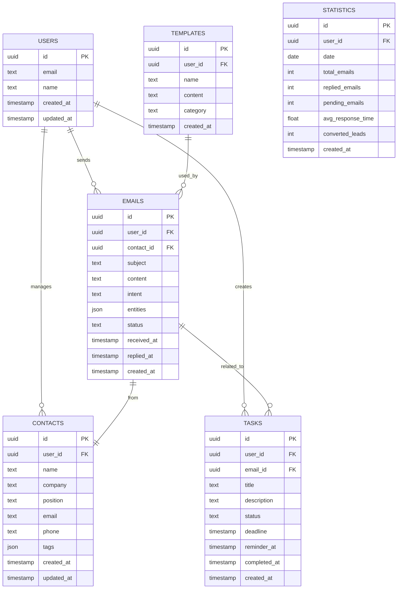

## 1. Architecture Design



## 2. Technology Description
- **Frontend**: React@18 + TypeScript + tailwindcss@3 + vite
- **State Management**: Zustand
- **Routing**: react-router-dom
- **Icons**: lucide-react
- **Charts**: recharts
- **Backend**: Supabase (Auth, Database, Storage)
- **AI Service**: LLM API (mock for demo)

## 3. Route Definitions

| Route | Purpose | Component |
|-------|---------|-----------|
| / | 收件箱分析页面 | InboxPage |
| /contacts/:id | 联系人详情页面 | ContactPage |
| /compose | 智能写信页面 | ComposePage |
| /tasks | 跟进任务页面 | TasksPage |
| /statistics | 统计概览页面 | StatisticsPage |

## 4. API Definitions

### 4.1 LLM API (Mock)

#### POST /api/analyze-email
分析邮件内容，识别意图和提取关键信息

**Request:**
```typescript
interface AnalyzeEmailRequest {
  content: string;
  subject: string;
}
```

**Response:**
```typescript
interface AnalyzeEmailResponse {
  intent: '咨询' | '投诉' | '报价' | '催办' | '其他';
  confidence: number;
  entities: {
    customerName: string | null;
    product: string | null;
    amount: number | null;
    deadline: string | null;
    contactInfo: string | null;
  };
  summary: string;
}
```

#### POST /api/generate-reply
生成邮件回复草稿

**Request:**
```typescript
interface GenerateReplyRequest {
  originalEmail: string;
  tone: 'formal' | 'friendly' | 'urgent' | 'professional';
  language: 'zh' | 'en';
}
```

**Response:**
```typescript
interface GenerateReplyResponse {
  draft: string;
  suggestions: string[];
}
```

#### POST /api/rewrite
改写润色邮件内容

**Request:**
```typescript
interface RewriteRequest {
  content: string;
  targetLanguage: 'zh' | 'en';
  style: 'formal' | 'casual' | 'professional';
}
```

**Response:**
```typescript
interface RewriteResponse {
  rewrittenContent: string;
  improvements: string[];
}
```

## 5. Server Architecture Diagram



## 6. Data Model

### 6.1 Data Model Definition



### 6.2 Data Definition Language

```sql
-- Users Table
CREATE TABLE users (
    id UUID PRIMARY KEY DEFAULT uuid_generate_v4(),
    email TEXT UNIQUE NOT NULL,
    name TEXT,
    created_at TIMESTAMP DEFAULT NOW(),
    updated_at TIMESTAMP DEFAULT NOW()
);

-- Emails Table
CREATE TABLE emails (
    id UUID PRIMARY KEY DEFAULT uuid_generate_v4(),
    user_id UUID REFERENCES users(id),
    contact_id UUID REFERENCES contacts(id),
    subject TEXT,
    content TEXT,
    intent TEXT,
    entities JSONB,
    status TEXT DEFAULT 'unread',
    received_at TIMESTAMP,
    replied_at TIMESTAMP,
    created_at TIMESTAMP DEFAULT NOW()
);

-- Contacts Table
CREATE TABLE contacts (
    id UUID PRIMARY KEY DEFAULT uuid_generate_v4(),
    user_id UUID REFERENCES users(id),
    name TEXT,
    company TEXT,
    position TEXT,
    email TEXT,
    phone TEXT,
    tags JSONB,
    created_at TIMESTAMP DEFAULT NOW(),
    updated_at TIMESTAMP DEFAULT NOW()
);

-- Tasks Table
CREATE TABLE tasks (
    id UUID PRIMARY KEY DEFAULT uuid_generate_v4(),
    user_id UUID REFERENCES users(id),
    email_id UUID REFERENCES emails(id),
    title TEXT,
    description TEXT,
    status TEXT DEFAULT 'pending',
    deadline TIMESTAMP,
    reminder_at TIMESTAMP,
    completed_at TIMESTAMP,
    created_at TIMESTAMP DEFAULT NOW()
);

-- Templates Table
CREATE TABLE templates (
    id UUID PRIMARY KEY DEFAULT uuid_generate_v4(),
    user_id UUID REFERENCES users(id),
    name TEXT,
    content TEXT,
    category TEXT,
    created_at TIMESTAMP DEFAULT NOW()
);

-- Statistics Table
CREATE TABLE statistics (
    id UUID PRIMARY KEY DEFAULT uuid_generate_v4(),
    user_id UUID REFERENCES users(id),
    date DATE,
    total_emails INT,
    replied_emails INT,
    pending_emails INT,
    avg_response_time FLOAT,
    converted_leads INT,
    created_at TIMESTAMP DEFAULT NOW()
);

-- Indexes
CREATE INDEX idx_emails_user_id ON emails(user_id);
CREATE INDEX idx_emails_status ON emails(status);
CREATE INDEX idx_emails_received_at ON emails(received_at);
CREATE INDEX idx_contacts_user_id ON contacts(user_id);
CREATE INDEX idx_tasks_user_id ON tasks(user_id);
CREATE INDEX idx_tasks_status ON tasks(status);
```

## 7. Security Considerations

### 7.1 Authentication
- 使用Supabase Auth进行用户认证
- JWT token存储在localStorage
- 路由保护：未登录用户只能访问登录页面

### 7.2 Authorization
- Row Level Security (RLS) 限制用户只能访问自己的数据
- 管理员角色拥有更高权限

### 7.3 Data Protection
- 敏感数据加密存储
- API请求使用HTTPS
- 定期安全审计